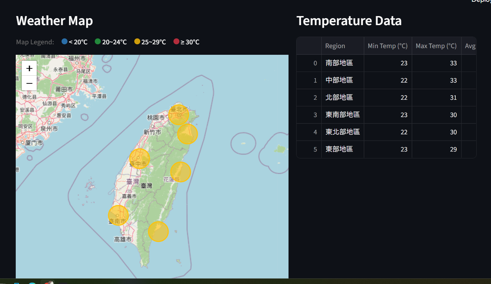
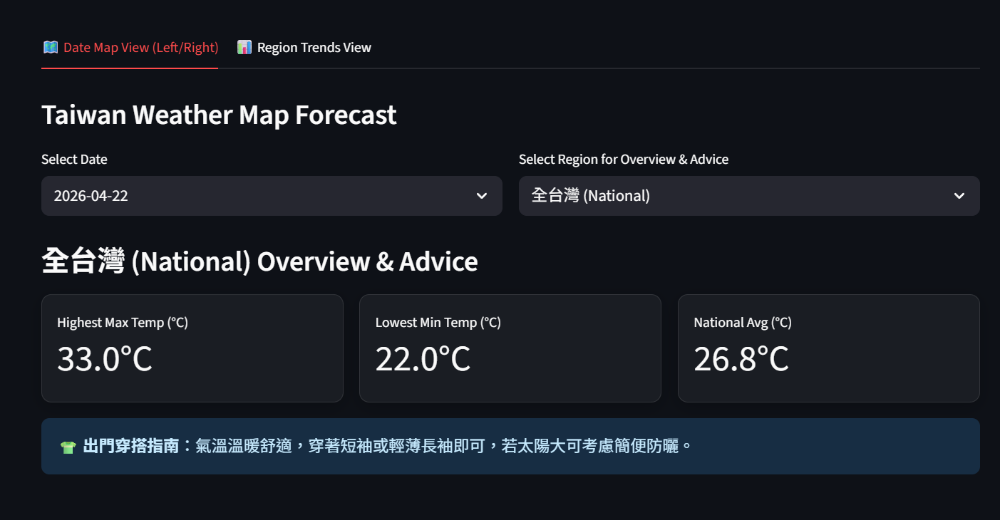
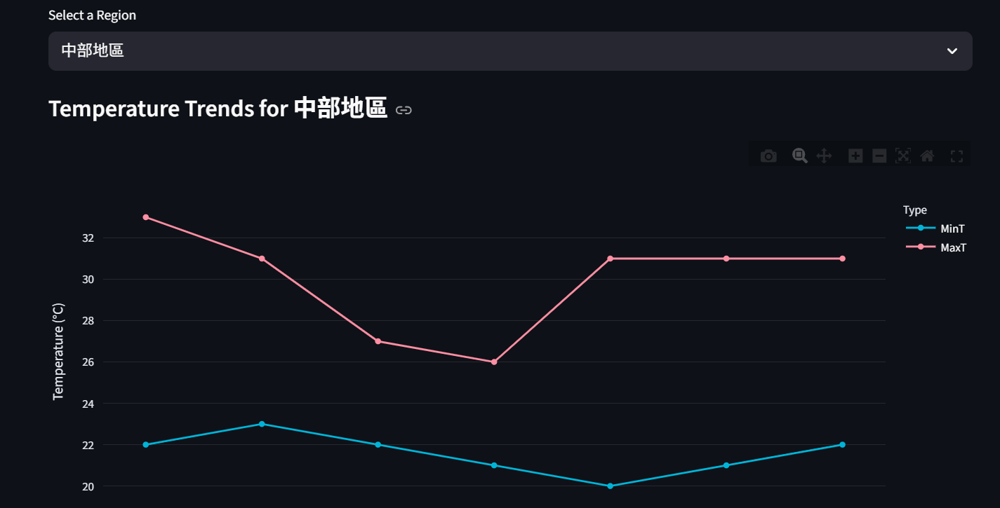
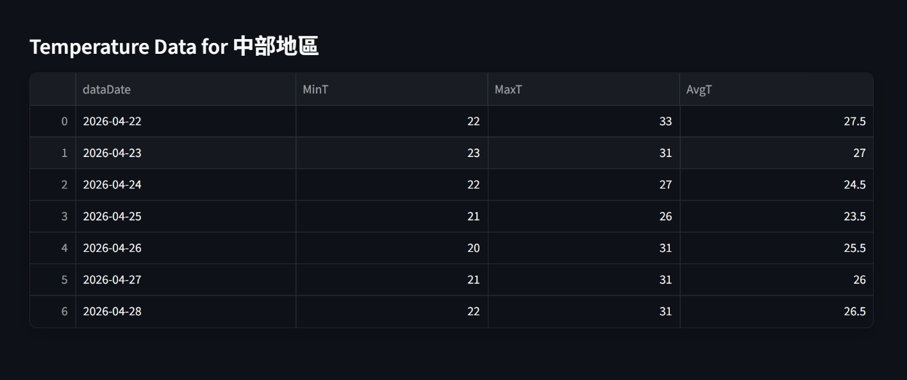

# HW2: Temperature Forecast Web App 🌤️

**Live Demo URL:** [https://kungtan-aiot-hm2-temp-forecast.streamlit.app/](https://kungtan-aiot-hm2-temp-forecast.streamlit.app/)

這是一個基於中央氣象署 (CWA) 開放資料 API 所開發的氣溫預報視覺化 Web 應用程式。本專案將一週的農漁業氣象預報資料抓取下來後，寫入 SQLite 資料庫中，最後使用 Streamlit 建立一個能與使用者互動的數據儀表板，包含動態地圖與氣溫趨勢圖。

---

## 🚀 專案功能特色

1. **即時 / 離線資料獲取 (`data_manager.py`)**：
   - 使用 `requests` 套件介接 CWA API，解析包含北部、中部、南部、東北部、東部及東南部地區的一週氣溫預報。
   - 支援備用存取機制：允許在離線狀態下讀取本地 `F-A0010-001.json` 檔案。
2. **SQLite3 資料庫整合**：
   - 將讀取、解析過後的最高溫 (MaxT) 與最低溫 (MinT) 等資料，寫入至名為 `data.db` 的資料庫。
   - 資料表 `TemperatureForecasts` 保存所有檢索需要的歷史與即時查詢依據。
3. **Streamlit 視覺化前端 (`app.py`)**：
   - **✨ Premium 質感設計**：導入 Google Fonts (Outfit)、漸層標題、Glassmorphism (玻璃擬物化) 卡片設計與懸浮微動畫，提供現代化且高質感的互動體驗。
   - **📊 數據儀表板 (Metric Cards) & 穿搭建議**：支援動態切換「全台灣」或「特定地區」，自動計算出當日最高/最低/平均氣溫，並依據均溫給出智慧「出門穿搭指南」(例如：提醒防曬或攜帶大衣)。
   - **📈 區域趨勢檢視 (Region Trends View)**：選擇特定地區後，繪製出一週氣溫變化的精美折線圖 (經過深色模式優化)，以及包含 `AvgT` 欄位的詳細報表。
   - **🗺️ 地圖檢視 (Date Map View)**：結合 HTML 排版與 `folium`，提供直觀的地圖與表格佈局。地圖支援溫度分層設色打點，並附有清楚的 **Map Legend (圖例)** 說明溫度範圍。

---

## 📸 系統截圖與功能展示

### 1. 互動式地圖與圖例


> 左側顯示基於 `folium` 繪製的台灣動態地圖，圓圈顏色會根據氣溫動態變化（藍、綠、黃、紅），並且上方附有清楚的地圖圖例 (Map Legend) 供使用者參考。右側則顯示各區的詳細氣溫總表。

### 2. 動態數據儀表板與穿搭建議


> 透過全新的地區下拉選單，使用者可以查看全台灣或特定地區的「最高溫」、「最低溫」及「平均溫」玻璃擬物化卡片 (Glassmorphism)。系統會依據平均氣溫，自動計算並給出相對應的出門穿搭指南。

### 3. 區域氣溫趨勢圖


> 進入 Region Trends View 標籤頁後，可透過 Plotly 繪製的一週氣溫折線圖，一目了然地觀察所選地區的溫度變化趨勢。圖表已針對深色模式進行背景透明化與視覺優化。

### 4. 詳細氣溫預報數據表


> 在趨勢圖下方，附有詳細的預測數據表格。除了保留原始的最高與最低溫外，還新增了 `AvgT` (平均氣溫) 欄位，提供更精確的氣候參考指標。

---

## 📂 專案檔案結構

```
d:\aiot_hm2_g\
│
├── app.py                   # Streamlit 前端 Web App 主程式
├── data_manager.py          # 後端爬蟲、JSON解析與 SQLite 資料庫操作模組
├── data.db                  # 系統自動建立的 SQLite 資料庫檔案
├── weather_data.csv         # 系統自動導出的預測資料備份
├── requirements.txt         # 執行此專案所需的 Python 依賴包
├── F-A0010-001.json         # 氣象局預報的備用離線資料集
├── development_log.md       # 本專案的開發與 debug 過程記錄檔
└── README.md                # 專案說明文件 (也就是本檔案)
```

---

## 🛠️ 安裝與環境建置

1. 請先確保你的環境已經安裝了 Python (推薦 Python 3.9 以上版本)。
2. 透過指令切換到本專案目錄下：

   ```bash
   cd d:\aiot_hm2_g
   ```

3. 建立並啟動 Python 虛擬環境：

   ```powershell
   python -m venv venv
   # 在 Windows 環境下啟動：
   .\venv\Scripts\Activate.ps1
   ```

4. 安裝依賴套件 (Dependencies)：

   ```bash
   pip install -r requirements.txt
   ```

---

## 📖 如何使用

### 方法 1: 啟動 Streamlit Web App (推薦)

啟動虛擬環境後，直接在終端機輸入：

```bash
streamlit run app.py
```

執行後，如果沒有跳出瀏覽器，可以自行打開畫面中顯示的 `Local URL` (通常是 `http://localhost:8501`)。
網頁左側有 **Data Controls** 選單，你可以切換「Local JSON (Offline)」或是「CWA API (Live)」模式。

> [!IMPORTANT]
> **資料更新機制**：當切換不同的資料模式 (Local JSON / CWA API) 後，請務必點擊下方的 **Refresh Data** 按鈕。系統才會真正去讀取對應的檔案或連結，並覆蓋原本的資料庫來更新畫面上的氣溫與日期！

### 方法 2: 獨立測試後端資料抓取

如果你想針對後端抓資料以及寫入資料庫這段邏輯單獨做測試，可以執行：

```bash
python data_manager.py
```

程式會從 API (或本地的 json) 解析檔案，並印出所有存在資料庫當中的地區清單與「中部地區」的詳細明細，以供驗證。

---

## 💡 注意事項

- 如果在 Windows PowerShell 無法執行 `Activate.ps1`，可能需要以管理員身分開啟 PowerShell 並解開權限限制 (`Set-ExecutionPolicy Unrestricted`)。
- 部署至 [Streamlit Community Cloud](https://share.streamlit.io/) 時，請一併將 GitHub repository 設定指向 `app.py` 即可獲得你的 Live Demo 網址。
